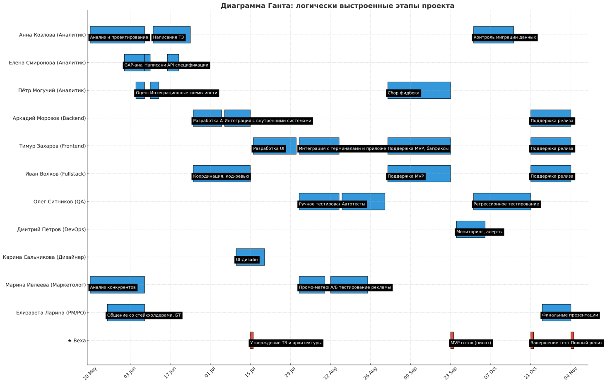

= PLM – автоматизация вывода новых продуктов
:toc:

== Общая информация
link:https://drive.google.com/file/d/1vIwR1l8w_P_GNkL1dNMbMhFEbHczlFFy/view[Презентация MVP проекта]

Система PLM (Product Launch Management) внедряется в сеть межконтинентальных закусочных "Замысловатость" для автоматизации процесса вывода новых продуктов на рынок. Проект направлен на сокращение времени выхода продукта и обеспечение стабильной передачи данных между ИТ-системами.

Проблема:
Сейчас, чтобы ввести новый продукт, уходит до 30 рабочих дней. 
Это долго, процесс размазан между отделами, часть задач делается вручную, нет прозрачности, всё в разных чатах и таблицах.

== Цели внедрения
Сейчас, чтобы ввести новый продукт, уходит до 30 рабочих дней. Это долго. Процесс размазан между отделами, часть задач делается вручную, нет прозрачности, всё в разных чатах и таблицах.

В рамках проекта планируется: сокращение времени на запуск нового блюда, централизованное управление рецептурой, отслеживание жизненного цикла продукта

== Описание проекта и задач
Анализ и проектирование PLM-системы
Разработка Backend-логики и API
Интеграция с внешними системами
Поддержка отказоустойчивости, мониторинга, безопасности

== Roadmap 

== Команда проекта
link:https://tracker.yandex.ru/pages/projects/2[Команда]

Анна Козлова — Lead SA

Елена Смиронова — SA
Пётр Могучий — SA 

Дмитрий Петров — DevOps

Олег Ситников — QA

Иван Волков - Разработчик FullStack

Марина Ивлеева - Маркетинг

Карина Сальникова — Дизайн

Елизавета Ларина — PM

Добрать разработчиков на аутстаф, frontend и backend

== Риски проекта
Методология оценки рисков

Для оценки рисков мы использовали стандартную методику:
Вероятность возникновения (низкая, средняя, высокая)

Серьёзность последствий (по шкале влияния на сроки, бюджет, качество)

RAG-анализ — присваиваем каждому риску цвет: красный (критичный), жёлтый (умеренный), зелёный (приемлемый)
Основные риски проекта:

* Сбой при интеграции с текущими системами Вероятность: средняя 

Последствия: блокировка внедрения, откат изменений Решение: создаём mock-интерфейсы и песочницу, заранее тестируем точки API. Участвуют backend-разработчики и DevOps.

* Недостаточная валидация требований 
Вероятность: высокая 

Последствия: баги в проде, переписывание логики, сдвиг сроков Решение: используем вовлечение бизнес-заказчиков в валидацию. Создаём тест-кейсы параллельно с API.

* Сопротивление пользователей 
Вероятность: средняя 

Последствия: низкий adoption, отказ от новой системы Решение: UX-дизайн на ранней стадии, обучающие материалы, пилотное внедрение, A/B-тесты
Потеря ключевых специалистов Вероятность: низкая Последствия: задержка задач, отсутствие знаний Решение: документирование, резервные роли, кросс-функциональность

* Зависимость от внешних поставщиков 

Вероятность: средняя 

Последствия: блокировка интеграций Решение: фиксируем соглашения на старте, делаем fallback-план Структура управления рисками: Мы используем журнал рисков (Risk Register), который обновляется еженедельно. Каждый риск содержит: • идентификатор и описание • вероятность и влияние • ответственного • план на случай наступления (contingency) Мониторинг рисков Мы проводим: еженедельные обзоры на стендапах 2-недельные ревью с PO при каждом релизе — переоценку рисков (ретроспектива + анализ ошибок)

== ATAM-сессия
link:https://docs.google.com/document/d/1IsVy2qB7SYHDlA1oS0xagQuf3pPbEUCcM85ILwPE5Fw/edit?tab=t.0[ATAM - сесия]

Проведён анализ атрибутов качества (надёжность, масштабируемость, мониторинг, безопасность).
Использованы сценарии (массовое обновление, сбой, атака, откат изменений).

Компромиссы: отказоустойчивость ↔ производительность, безопасность ↔ удобство.

== Архитектура проекта
link:https://docs.google.com/document/d/1crFTvXlBzWO5yg0GOUXJlhSVGzGcgHoKmz8yqd_A5UE/edit?tab=t.0[Архитектура]

Прикреплены:

Контекстная диаграмма

Контейнерная диаграмма

Компонентная диаграмма

== Безопасность и нефункциональные требования
Методология: ISO/IEC 27001

Авторизация: OAuth2, Token Validation
Масштабируемость: Kafka, retry, circuit-breakers
Мониторинг: Prometheus, Grafana
Логирование: Kafka, AuditLogger, Logstash

== Заключение
Проектная работа охватывает все фазы внедрения PLM: от аналитики до сопровождения. Архитектура соответствует современным требованиям, устойчиво масштабируется и легко поддерживается.
